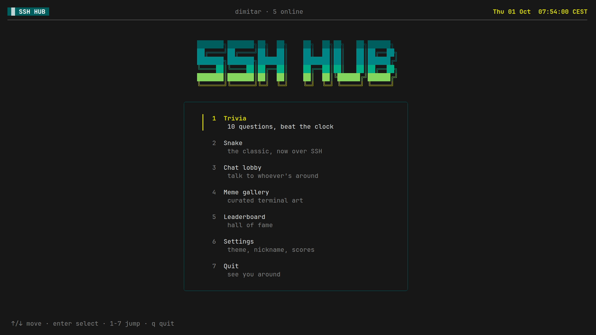
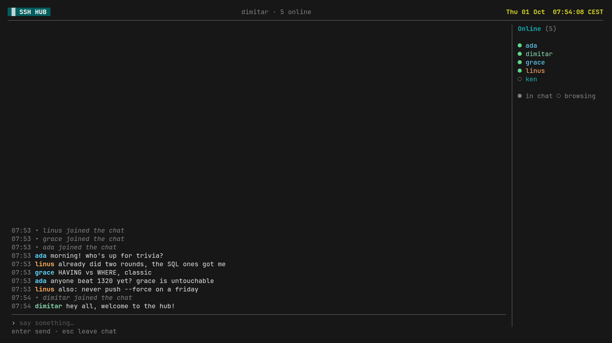
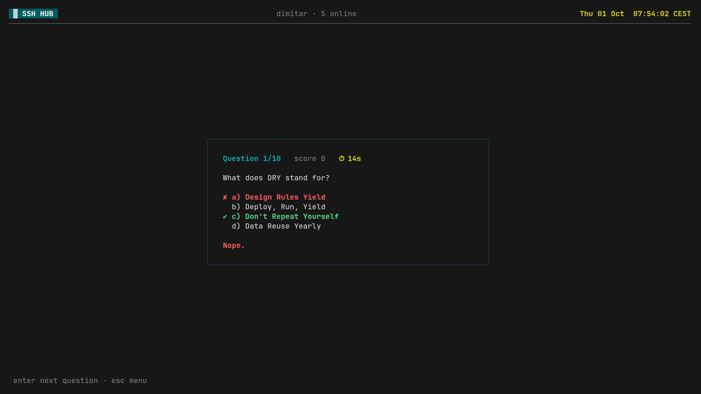
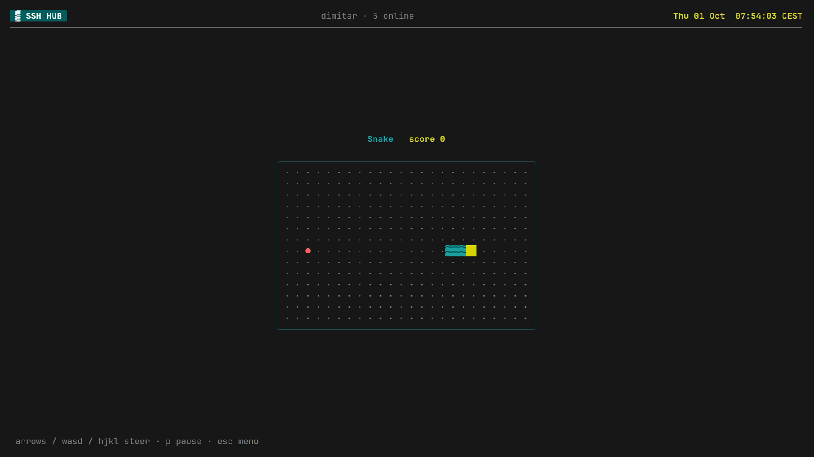
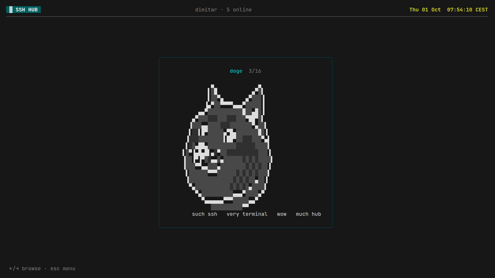
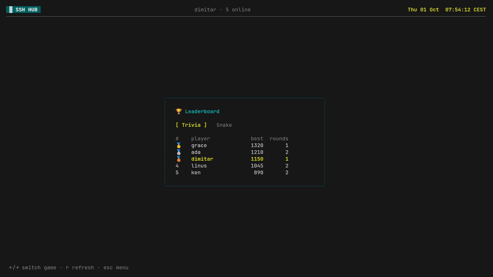
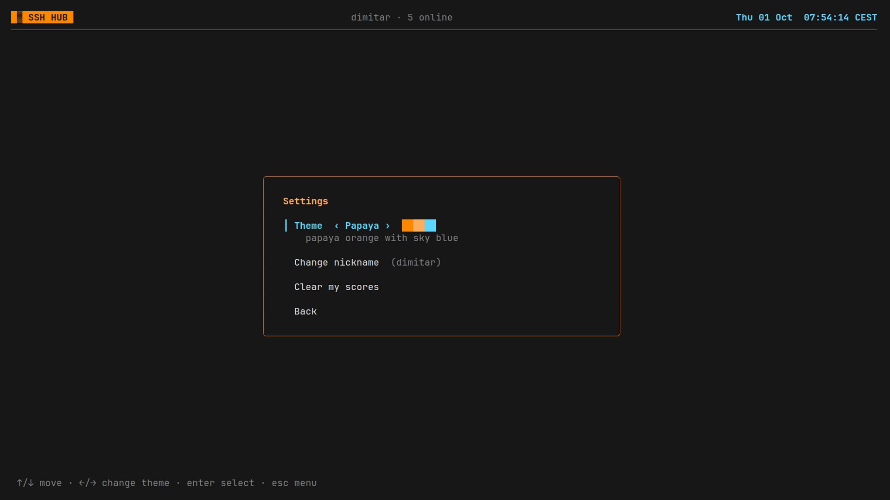

# sshhub

A hangout spot you reach over SSH: trivia, snake, a chat lobby with an online list, a meme gallery and a leaderboard, with a live clock in the header. No shell access — every connection lands in the TUI.



## Features

**Chat lobby** — live chat with everyone connected, plus an online list showing who's chatting (●) and who's elsewhere in the hub (○).



<table>
  <tr>
    <td width="50%"><b>Trivia</b> — 10 random questions from a bank of 100+, 15 seconds each, faster answers score more.<br><br></td>
    <td width="50%"><b>Snake</b> — the classic, over SSH. It speeds up with every apple.<br><br></td>
  </tr>
  <tr>
    <td width="50%"><b>Meme gallery</b> — terminal art, browse with ←/→.<br><br></td>
    <td width="50%"><b>Leaderboard</b> — best score per player, one tab per game.<br><br></td>
  </tr>
  <tr>
    <td width="50%"><b>Settings</b> — pick a theme, change your nickname, or wipe your scores (asks first).<br><br></td>
    <td width="50%"><b>Themes</b> — six color schemes, saved with your profile:<br><br>
      <b>Racing Green</b> (default) · <b>Rosso Corsa</b> · <b>Papaya</b> · <b>Silver</b> · <b>Midnight</b> · <b>Racing Blue</b><br><br>
      <sub>Inspired by the historic national racing colors and motorsport color traditions. Not affiliated with any team or with Formula 1.</sub></td>
  </tr>
</table>

## Run

```sh
go build -o sshhub .
./sshhub                       # listens on :23234, creates hub.db and .ssh/id_ed25519
ssh -p 23234 localhost         # connect
```

Flags: `-addr`, `-db`, `-hostkey`, `-dev` (allow several sessions per person, handy for testing locally).

The repo pins a newer Go toolchain in `go.mod`; with Go 1.21+ installed it is downloaded automatically.

## Identity

- Connecting with an SSH key: the key fingerprint is your account. You pick a nickname on first login and scores are saved.
- Connecting without a key (`ssh -o PubkeyAuthentication=no you@host`): guest session, named after your SSH username, scores not saved.
- Settings: key users can change their nickname (the leaderboard follows, since scores belong to the key) and clear all their scores. Theme choice is saved per key; guests keep it for the session.
- One session per person: logging in again (same key, or for guests same address and username) closes the older session. Run with `-dev` to turn this off.

## Adding content

- Trivia: edit `assets/questions.json` (`answer` is the index into `choices`; choices are shuffled at runtime).
- Memes: drop `.txt` or `.ans` files into `assets/memes/`. A leading `NN-` sets the order. Images can be converted with e.g. `chafa --size 60x25 pic.png > assets/memes/07-pic.ans`.

Assets are embedded, so rebuild after changes.

## Screenshots

`scripts/screenshots/screenshots.sh` regenerates the images in `docs/screenshots/`. It runs a demo server with seeded players and chat bots, and records a scripted SSH session with [VHS](https://github.com/charmbracelet/vhs) in headless Chrome, so nothing opens on your desktop. Needs `vhs`, `ttyd`, `ffmpeg` and Chrome/Chromium.
